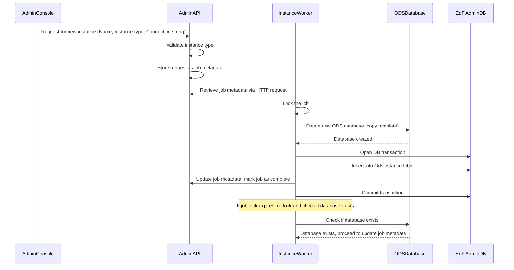

# Instance Management Worker Process Design and Developer Instructions

## Overview

The Instance Management Worker Process is a  component of the Admin Console application, designed to handle various system-level operations such as creation, renaming, and deletion of instances. This process operates on metadata managed by the Admin Console within the Admin API product. By leveraging job metadata, the Instance Management Worker ensures efficient and reliable execution of tasks, maintaining the integrity and consistency of the system. This robust process is essential for managing the lifecycle of instances, providing a seamless and automated approach to instance management. 

## Development Pre-Requisites

- [.NET 8.0 SDK](https://dotnet.microsoft.com/download/dotnet/8.0)
- Suggested to have either:
  - [Visual Studio 2022](https://visualstudio.microsoft.com/downloads), or
  - [Visual Studio 2022 Build
    Tools](https://visualstudio.microsoft.com/downloads/#build-tools-for-visual-studio-2022)
    (install the ".NET Build Tools" component)
- Clone [this
  repository](https://github.com/Ed-Fi-Alliance-OSS/Ed-Fi-Admin-Console-Instance-Management-Worker-Process.git) locally

## Process Sequence Diagram

