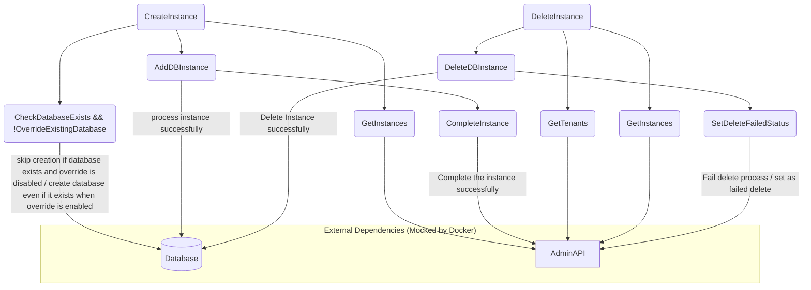

# Ed-Fi Admin Console Instance Management Worker Process Diagram

This document contains a Mermaid diagram visualizing the architecture and workflow of the Instance Management Worker Process.

## Instance Management Worker Process Diagram



## End-to-End Testing Approach

The Instance Management Worker Process is tested using an end-to-end (E2E) testing approach that validates the complete workflow from API interactions through database operations.

### E2E Test Framework

The E2E tests are implemented using PowerShell scripts with Pester, a testing framework for PowerShell. The tests are located in the `/tests/E2E/` directory.

### Testing Process

1. **Environment Setup**:
   - Tests use environment variables defined in a `.env.example` (changing its name to `.env`) file
   - The `Read-EnvVariables` function loads these settings for test execution

2. **Test Execution Flow**:
   1. **Client Registration**: Register a new client with the Admin API
   2. **Authentication**: Obtain an access token for API operations
   3. **Instance Creation**: Create a new ODS instance with "Pending" status
   4. **Worker Process Execution**: Invoke the Instance Management Worker Process via Docker
   5. **Status Verification**: Check if the instance status has changed to "completed"
   6. **Assertions**: Use Pester to verify expected outcomes

### Docker Integration

Tests use Docker to run the Instance Management Worker Process:
- The worker process is containerized using a Dockerfile in the `/docker` directory
- The Docker image must be built before running the tests:
  ```powershell
  docker build -t edfi.adminconsole.instancemanagementworker -f docker/Dockerfile .
  ```
- The test script invokes the container with appropriate parameters:
  ```powershell
  docker run --rm edfi.adminconsole.instancemanagementworker dotnet EdFi.AdminConsole.InstanceManagementWorker.dll --isMultiTenant=true --tenant="$env:DEFAULTTENANT" --ClientId="$env:clientId" --ClientSecret="$env:clientSecret"
  ```

### Test Validation

The tests validate that:
1. The worker process correctly connects to the Admin API
2. Instances with "Pending" status are processed
3. Database operations are performed correctly
4. Instance status is updated to "completed" when successful

### Running the Tests

To run the E2E tests:
1. Ensure Docker is running
2. Build the worker process Docker image
3. Configure the `.env` file with appropriate values
4. Execute the test script:
   ```powershell
   cd tests/E2E
   ./e2eTest.ps1
   ```

### Test Dependencies

The E2E tests require:
- PowerShell 7 with Pester module
- Docker
- Access to Admin API services
- Valid client credentials

## Current State and Next Steps

### Current State

The environment is set up using Docker to run Admin API along with their databases. The Admin API was updated to use the latest endpoints, and corresponding payloads were adjusted to match the new schema.

This setup enables running the Instance Management Worker. However, the E2E test currently fails because the Instance Management service attempts to authenticate using a Keycloak-generated token. Since the Admin API now uses self-contained authorization (Keycloak has been removed), this causes a token mismatch and results in authentication failure.

### Next Steps

- **Update Instance Management Worker** to support Admin API’s new self-contained authorization  
- **Remove dependency on Keycloak** for Instance Management authentication  
- **Create a new ticket** to track the work required for the auth update